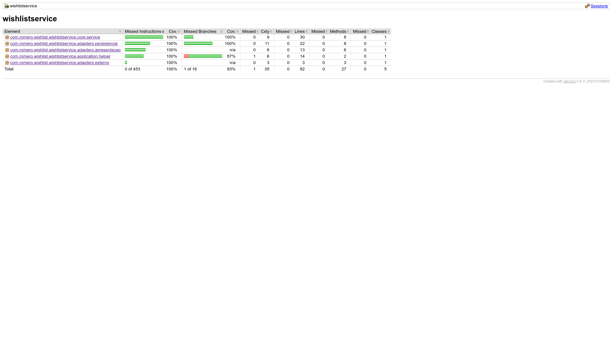

# wishlistservice

## Configurando ambiente

### Instalar docker executar os comandos

[docker install tutorial](https://www.hostinger.com.br/tutoriais/container-docker?ppc_campaign=google_search_generic_hosting_all&bidkw=defaultkeyword&lo=9100232&gad_source=1&gclid=Cj0KCQjwk6SwBhDPARIsAJ59GwfAgdRW8oePCQJDCKgO4l7WwZROfqJzdVMbYIFOz1ty5fAAYh7CrVoaAiZXEALw_wcB)

### Executar os comandos

``` docker pull mongo ```

``` docker run -d --name wishlist-mongodb -e MONGO_INITDB_ROOT_USERNAME=wishlist -e MONGO_INITDB_ROOT_PASSWORD=wishlist -e MONGO_INITDB_DATABASE=wishlist -p 27017:27017 mongo```

## Endpoints e Collections

### Criar um favorito na wishlist
```curl --location --request POST 'localhost:8080/wishlist' \
--header 'Content-Type: application/json' \
--data-raw '{
  "id_cliente": "98c169ce-891d-45e2-92f0-cc776ac8d0da",
  "id_produto": "1f51d85b-e112-481d-bd5f-c0f312e593b8"
}'
```

### Consultado Favoritos de um cliente
```
curl --location --request GET 'localhost:8080/wishlist/35dbee11-be22-4792-8dc9-668e2c6d0742'
```

### Consultando um favorito da wishlist
```
curl --location --request GET 'localhost:8080/wishlist/35dbee11-be22-4792-8dc9-668e2c6d0742/d79b3cc6-ac4a-4f1b-9a26-36cfc778cd18'
```

### Removendo um favorito da wishlist
```
curl --location --request DELETE 'localhost:8080/wishlist/35dbee11-be22-4792-8dc9-668e2c6d0742/1f51d85b-e112-481d-bd5f-c0f312e593b8'
```

# Observação
Não foram realizados os testes de integração junto com o BDD por falta de tempo a semana com feriados e ida ao presencial que fica em outra cidade deixou meu tempo bem curto mas o projeto foi codado utilizando a metodologia BDD e TDD. 

## Porém os testes unitários estão com 100% de cobertura


